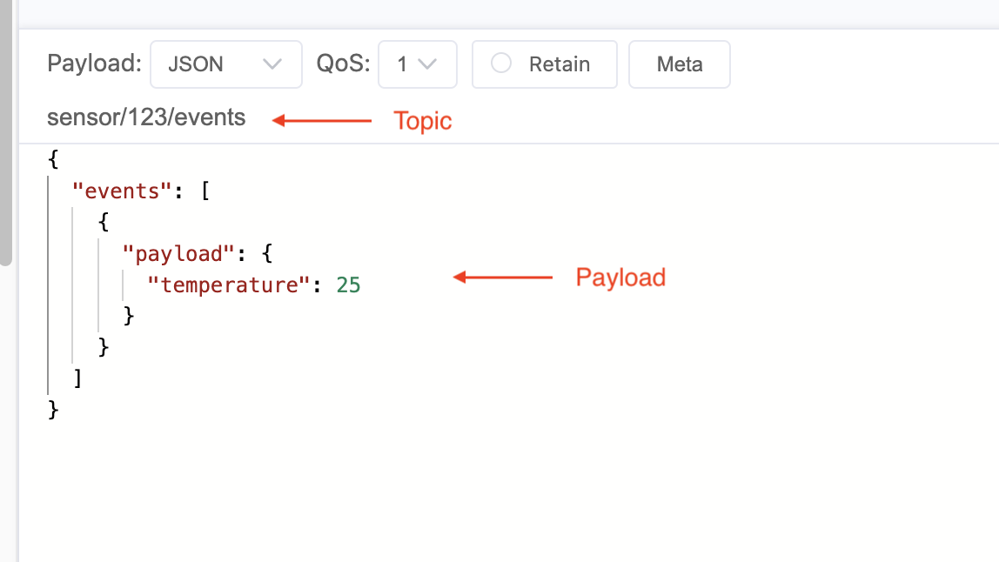

## Steps to reproduce the problem
1. Clone the app
2. Make docker up and running by (to run mosquitto): `docker-compose up -d --build`
3. Run the app: `npm run start:dev`
4. Then publish an event from a local app that supports mqtt (like MQTTX):



Then the error:

```
TypeError: response.status is not a function
    at ExpressAdapter.reply (/Users/vahid/casenio/dnw/tdk-api/node_modules/@nestjs/platform-express/adapters/express-adapter.js:28:22)
    at SentryGlobalFilter.handleUnknownError (/Users/vahid/casenio/dnw/tdk-api/node_modules/@nestjs/core/exceptions/base-exception-filter.js:46:28)
    at SentryGlobalFilter.catch (/Users/vahid/casenio/dnw/tdk-api/node_modules/@nestjs/core/exceptions/base-exception-filter.js:17:25)
    at SentryGlobalFilter.catch (/Users/vahid/casenio/dnw/tdk-api/node_modules/@sentry/nestjs/src/setup.ts:110:49)
    at <anonymous> (/Users/vahid/casenio/dnw/tdk-api/node_modules/@sentry/nestjs/src/integrations/sentry-nest-instrumentation.ts:292:40)
    at <anonymous> (/Users/vahid/casenio/dnw/tdk-api/node_modules/@sentry/node/node_modules/@sentry/opentelemetry/src/trace.ts:58:15)
    at Module.handleCallbackErrors (/Users/vahid/casenio/dnw/tdk-api/node_modules/@sentry/core/src/utils/handleCallbackErrors.ts:25:26)
    at <anonymous> (/Users/vahid/casenio/dnw/tdk-api/node_modules/@sentry/node/node_modules/@sentry/opentelemetry/src/trace.ts:57:14)
    at NoopContextManager.with (/Users/vahid/casenio/dnw/tdk-api/node_modules/@sentry/node/node_modules/@opentelemetry/api/src/context/NoopContextManager.ts:31:15)
    at ContextAPI.with (/Users/vahid/casenio/dnw/tdk-api/node_modules/@sentry/node/node_modules/@opentelemetry/api/src/api/context.ts:77:42)
```